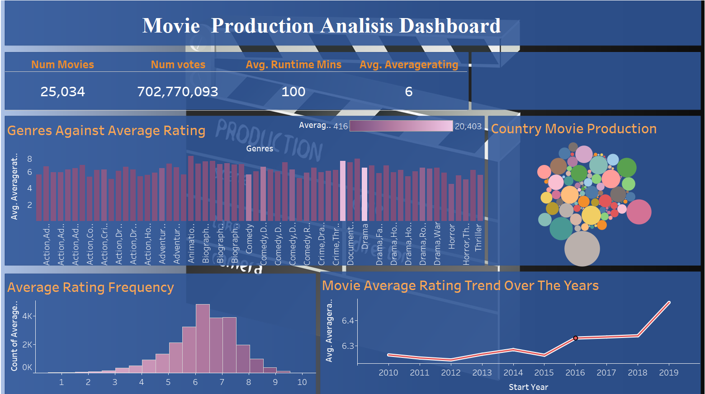

# Movie Analysis: Exploring what type of films are currently doing the best at the box office

## Overview
With big firms creating original video content, the entertainment sector is changing quickly. The company wants to take advantage of this trend by opening a new film studio.
Our goal is to determine the kinds of films that do well at the box office and use this information into actionable insights that the head of the company's new movie studio can use to help decide what type of films to create.

## Table of Contents
- [Project Overview](#project-overview)
- [Business Problem](#business-problem)
- [Data](#data)
   - [Data Understanding](#data-undestanding)
   - [Data Cleaning](#data-cleaning)
- [Installation](#installation)
- [EDA](#eda)
- [Recommendations](#recommendations)
- [Conclusion](#conclusion)
- [Tableau](#Tableau)

## Business Problem
The company now sees all the big companies creating original video content and they want to get in on the fun. They have decided to create a new movie studio, but they don’t know anything about creating movies. We aim to:
1. Identify which genres are most popular.
2. Identify top 10 studios on average rating.
3. Compare relationship between production budget and total gross income.
4. Which Studio generates most income.

Doing this will help the company decide on what genres they can produce to maximize on income for the new movie studio.
## Data
### Data Undestanding
The Data is in form of a zippedData folder that contains diverse movie datasets from industry platforms such as Box Office Mojo, IMDB, Rotten Tomatoes, TheMovieDB, and The Numbers. These datasets are presented in various formats, including compressed CSV and TSV files, which can be accessed via spreadsheet software or Python's pandas library using pd.read_csv. The IMDB data is stored in a SQLite database, requiring SQL queries for extraction. This variety presents an opportunity for data integration, necessitating careful standardization to derive comprehensive insights into movie performance and audience trends, which will inform strategic decisions for our new movie studio.
#### bom.movie_gross.csv
This dataset contains data on movies, including revenue details, studio information, and release years. It includes 3,387 rows and five columns which are `title`, `studio`, `domestic_gross`,`foreign_gross`and `year`.
#### rt.movie_info.tsv
This dataset provides key information about a selection of movies, including their ratings, genres, directors, writers, release dates, and runtimes. It has a total of 1,560 rows and the following columns: `id`,`rating`,`genre`, `director`, `writer`,`theater_date` and `runtime`

#### rt.reviews.tsv
**Columns**
`id`,`review`, `rating`,`fresh`, `critic`, `publisher` and `date`

#### tmdb.movies.csv
This dataset provides essential metadata on over 26,517 movies(rows), including genre information, popularity metrics, and audience ratings. It has the following columns: `Unnamed: 0`, `genre_ids`, `id`,`original_language`, `original_title`, `popularity`, `release_date`, `title`, `vote_average` and `vote_count`

### tn.movie_budgets.csv
This dataset provides financial information on 5,782 movies, including production budgets and gross earnings. It is valuable for analyzing the financial success of movies by comparing production costs with domestic and worldwide revenues. It has the following columns: `id`, `release_date`, `movie`, `production_budget`,    `domestic_gross` and `worldwide_gross`
### im.db 
This zipped file contains an SQLite database (im.db).
It has the following tables: directors, movie_akas, movie_ratings, principals, known_for, movie_basics,   persons and writers 

### Data Cleaning
Once the libraries had been imported, we loaded the tsv/csv files into dataframes and started cleaning the data. The missing values are identified for each column to understand the extent and distribution. With regards to the foreign_gross column, we ensured that the column had numerical data by replacing any symbols in the row values. There were also a fair number of null values which we dealt with by replacing the null values with the median of the column. The same process is repeated for the domestic_gross column. We dropped unnecessary columns in the info data file and replaced null values with N/A
Missing values were addressed for columns like runtime_minutes, genres, and region. Categorical and numerical data were standardized and cleaned. Data was validated post-insertion to confirm successful loading
## EDA
### Regional Average Ratings Visualization

To explore regional performance, we plotted a bar graph comparing average ratings across top 10 and bottom 10 regions. This visualization helps identify which regions tend to have lower-rated movies, potentially revealing insights about market preferences or production quality variations across different geographical areas. By examining the bottom 10 regions in terms of average rating, we can gain a better understanding of how location impacts movie perception and performance in our dataset.

### Comparing Studio Performance: Domestic vs Foreign 

To analyze the financial performance of studios in our dataset, we created two separate queries to calculate the total domestic and foreign grosses for the top 10 studios. We then combined these results into a single visualization.This visualization allows us to compare the relative performance of studios across domestic and international markets. By examining which studios excel in both domestic and foreign box office performances, we can gain insights into successful global strategies and potentially identify opportunities for expansion or partnerships between studios.

### Consolidating and Analyzing Multi-Sourced Data

We merged three dataframes to create a comprehensive dataset, integrating information from various sources. This consolidated data allowed us to analyze studio performance across different metrics. By calculating mean average ratings per studio and visualizing the top performers, we gained insights into audience preferences and studio quality. This analysis provides valuable information for content strategy development and market expansion considerations in the film industry.

### Genre Frequency Visualization

We created a histogram to display the most frequent genres in our dataset. This visualization quickly reveals which genres dominate our collection of movies, offering insights into market trends and audience preferences. It serves as a foundation for further genre-specific analyses, allowing us to focus on the most common categories for more in-depth exploration.

### Financial Performance Analysis

We crafted a SQL query to calculate the gross-to-budget ratio for each movie, identifying highly profitable productions. The query groups movies by title, calculates total gross revenue, and computes the ratio of total gross to production budget. We filtered for movies with ratios below 1000, indicating exceptional financial performance. Additionally, we created a correlation matrix to examine relationships between financial metrics, providing insights into profitable movie productions and potential factors influencing financial success in the film industry.
### Outlier Removal and Visualization

To ensure our analysis focuses on typical financial performance, we removed outliers from our dataset. Using interquartile range (IQR), we identified values outside the range of Q1 - 1.5IQR and Q3 + 1.5IQR as outliers. After removing these extreme values, we created a box plot to visualize the distribution of gross-to-budget ratios. This visualization provides a clearer representation of typical financial performance in the film industry, allowing us to make more accurate comparisons and draw meaningful conclusions about movie profitability.

### Genre-Vote Popularity Analysis

We plotted a bar chart to visualize the relationship between movie genres and their vote popularity scores. This visualization allows us to compare genre popularity across the dataset, identify trending genres, and uncover potential correlations between genre characteristics and audience reception. By examining this relationship, we can gain insights into audience preferences and guide content creation decisions, ultimately contributing to a deeper understanding of market dynamics in the film industry.

## Recommendations
- The company can partner with established studios like UTMW or GRTINDIA for co-productions. This can provide access to their resources, talent pool, and distribution channels, enhancing the quality and market reach of their films.
- For high-budget films, the company can invest in genres with proven box office success (e.g., Action, Adventure).There is a strong positive correlation between production budget and worldwide gross revenue . This indicates that higher budgets generally lead to higher gross revenues.
- The company can prioritise films that have high popularity. This can guide the studio's production strategy, and as can be seen from EDA, the genre that is most popular is Drama

## Conclusion
In summary, these recommendations provide a strategic roadmap to enhance the company’s competitive edge in the film industry. By partnering with established studios such as UTMW or GRTINDIA, the company can leverage existing industry resources, talent, and distribution networks, improving both film quality and reach. Focusing high-budget investments on Action and Adventure genres aligns with the positive correlation observed between production budget and worldwide gross revenue, increasing the potential for profitable returns. Furthermore, prioritizing popular genres like Drama will help attract a broad audience and maintain relevance in the competitive entertainment landscape.

By implementing these strategies, the company is well-positioned to capitalize on high-demand genres, expand its market presence, and drive sustainable growth in the movie industry.

## Tableau
[Tableau](https://public.tableau.com/shared/H7W7YHDRG?:display_count=n&:origin=viz_share_link)

